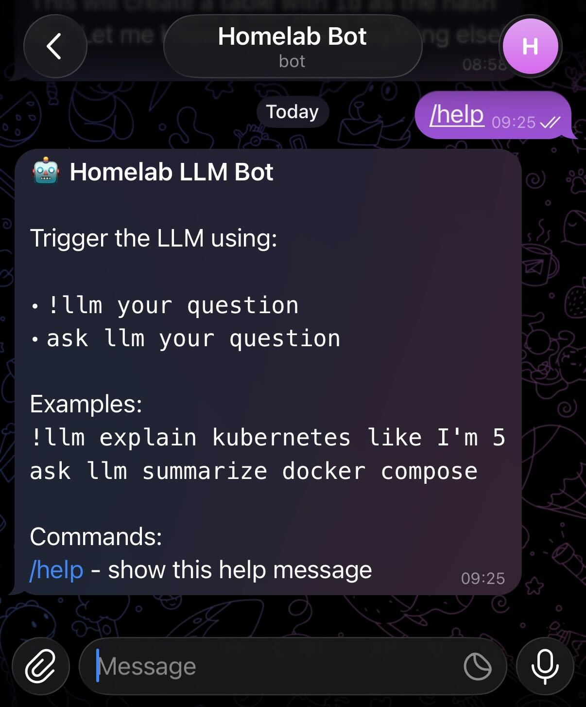
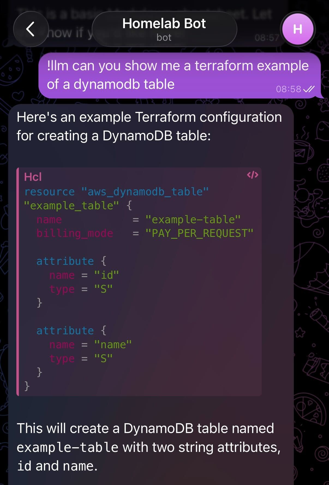

# telegram-llm-bot

## Setup

Configure authentication to Telegram and saving your token.

### Create Telegram Token

1. Go to BotFather on Telegram
2. Run `/newbot`
3. Follow Instructions

### Save environment variables

1. Run `cp sample.env .env`
2. Persist token and config details

### Start the Bot

```bash
docker compose up -d --build
```

## Screenshots

Screenshots from Telegram.

### Using `/help`:



### Using `!llm`:



